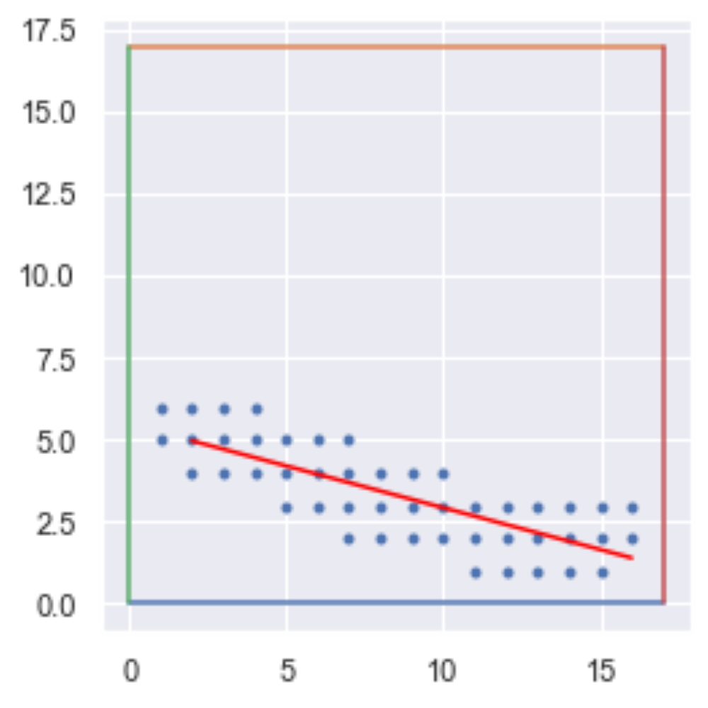
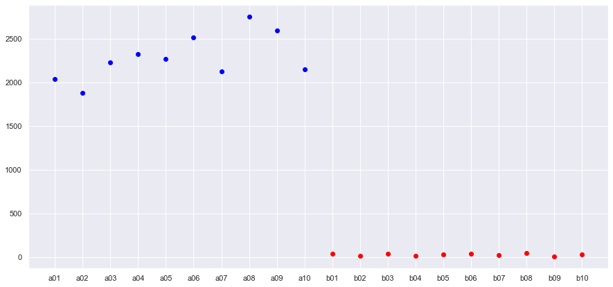

<!-- #region -->
# Rapport de projet image: Zéros et uns manuscrits


## Introduction :
Ce mini-projet est un classificateur de zéros et de uns manuscrits en python faisant office de projet mi-semestre au cours d'<a href="https://nicolas.thiery.name/Enseignement/IntroScienceDonnees/">Initiation à la Science des Données</a> offert en L1-S2 à l'Université Paris-Saclay. <br><br>

<br>

------

<br>

## Auteurs :
<br>

| Nom  | Prénom | Courriel | Groupe | Github |
| :-------------: | :-------------: | :-------------: | :-------------: | :-------------: |
| AIT BELKACEM  | Moncef Karim  | moncef.ait-belkacem@universite-paris-saclay.fr  | LDDIM2  |<a href="https://github.com/MK8BK">MK8BK</a>|
| Tran--Guery | Thimoté | thimote.tran--guery@universite-paris-saclay.fr  | LDDIM2  |<a href="https://github.com/Thimote91">Thimote91</a>|


<br>

------

<br>

## Sujet:
Nous avons choisi le jeu de données zéros et uns manuscrits.

Ce choix n’est pas anodin, les applications d’(O)ptical (C)haracter (R)ecognition sont omniprésentes depuis quelques années.

La reconnaissance de lettres permet par exemple la conversion d’images en documents.

Nous avons bien étudié le sujet : la classification d’images contenant des zéros ou des uns manuscrits.

Le jeu de données est un set de 20 images monochromes polarisées au format PNG(portable network graphics).

Elles sont divisées en deux lots : ^a et ^b.

Celles commençant en a sont des zéros manuscrits, celles commençant en b sont des uns manuscrits.

Il nous est demande de classifier ces images de manière algorithmique, en employant des attributs implémentés lors de la Semaine 3 du cours, ou des classificateurs présents dans la librairie Scikit-Learn.

Nous devions ensuite respecter toute la pipeline(le ou la ?) d’un projet de Science des données, à savoir :


VI-ME-RÉ-BAR :
   - prétraitement et [VI]sualisation 
   - [ME]sure de performance ([ME]tric)
   - [RE]férence (base line)
   - [BAR]res d'erreur (error bar)


<br>

------

<br>

## Détails du travail effectué :

Nous regroupons ici les extraits les plus intéressants de notre etude.

Pour des raisons d'esthétique, nous utilisons du pseudo-code.


Nous employons 4 attributs :
- l'attribut `elongation` implementee en semaine 3
- l'attribut `nb_bandes` qui retourne le ratio de lignes possedant plus d'une bande noire.
- l'attribut `boucle` qui detecte si l'image en question contient une boucle
- l'attribut `diffusion` qui emploie une rotation ainsi qu'une regression lineaire afin de separer les 0 et les 1.


### Élongation
L'algorithme implémenté dans la fonction `elongation()` disponible depuis la semaine 3 renvoie un score d'élongation des pixels non blancs de l'image.


<br><br>


### Nombre de bandes:
L'algorithme implémenté dans la fonction `nb_bandes_zeros()` décompose chaque images en lignes,

puis parcourt chaque ligne à la recherche de pixels noirs non contigus.

Le ratio de lignes contenant des bandes noires séparées est renvoyé.


<br><br>


### Boucle(s):

La fonction itérative `boucle()` qui appelle la fonction récursive `entouree()` sur chaque pixel blanc d'une image retourne un booléen.

 Si un pixel au moins est entouré "cerné" de cases noires *ie*: pas d'issues vers les extrémités, alors l'image contient une boucle.


<p style="float:right">pixels "cernés" en rouge</p>
<br><br>


### Diffusion: 
Cette fois, on effectue une rotation de 90 degrés, 
puis on récupère tous les pixel noirs(leurs positions) et on trace un nuage de points.

En effectuant une régression linéaire, on obtient le ESS:
    
&nbsp;&nbsp;&nbsp;&nbsp;&nbsp;  La somme totale des carrés des différences entre données expérimentales et prédictions de la régression.
$$
ESS = \sum_{i=1}^{n} (y_i - (a*x_i + b))^2
$$

où $y_i$ et $x_i$ sont les valeurs expérimentales,

$a$ et $b$ sont les coefficients obtenues par régression linéaire. 
<br><br>
$$
    a =\frac{\sum_{}^{} (x_i - \bar{x})*(y_i - \bar{y})}{\sum_{(x_i - \bar{x})^2}}
    \>\>,\>\>\>\>\>\>\>\>\>\>\>\>\>\>\>\>
    b = \bar{y} - a*\bar{x}
$$
où $\bar{x}$ et $\bar{y}$ sont les moyennes des échantillons respectifs.
<br><br>


<p align="center" style="display:inline-block">
  <br>
  
  
  
</p><br>


<br>

On peut alors grapher le ESS de chaque image:
<br><br>
<br>


<br>

------

<br>

## Démonstration
<a target="blank" href="https://nbviewer.org/github/MK8BK/SDprojet_image_s2/blob/master/4_analyse_de_donnees.ipynb?flush_cache=true">Voire sur nbviewer</a>

Afin d'exécuter, cliquer sur le bouton "execute on binder" (trois petits cercles en haut à droite).
<br>

------

<br>
<!-- #endregion -->

```python


```
